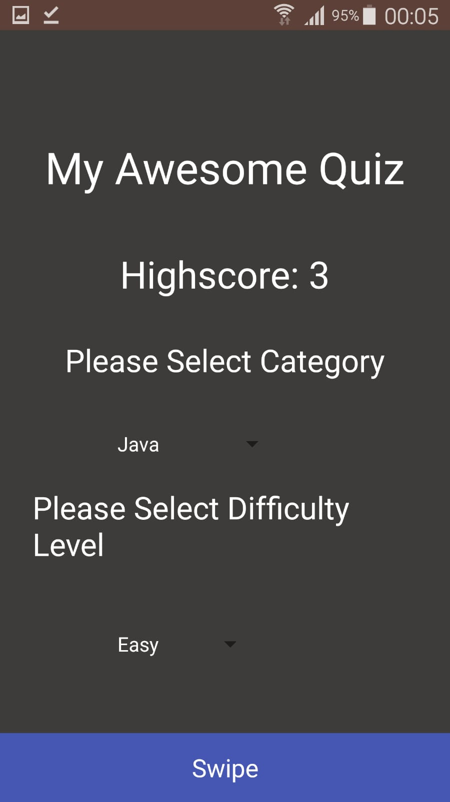
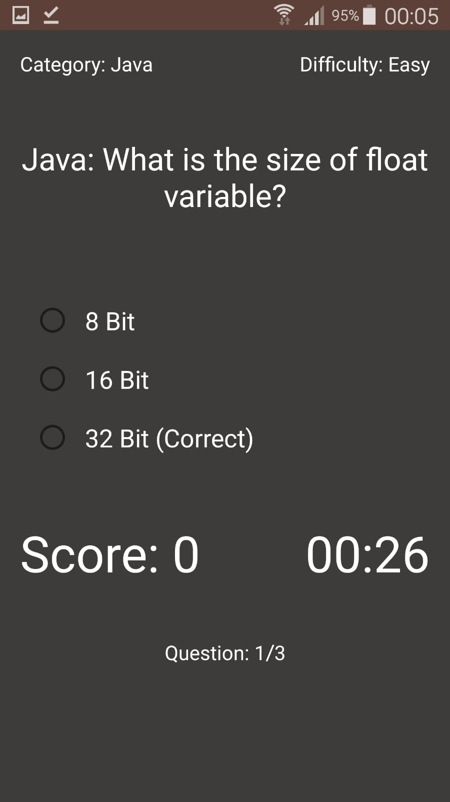
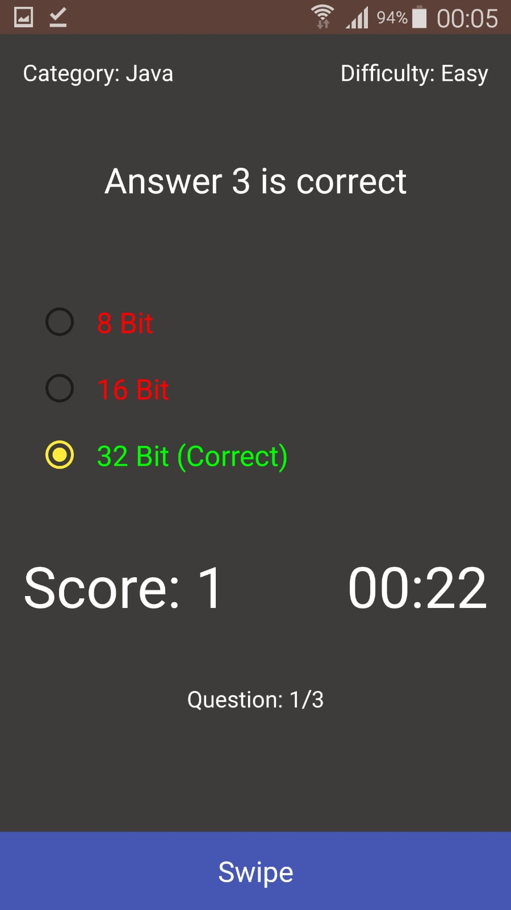

# Quiz App - Android
- Quiz Application
- Android Studio - IDE
- Built using Java 
- XML
- SQLite for Database
- Android Application that allows users to play a series of quizzes.
- Programming Languages to Choose From (Java, PHP and JavaScript) when playing
- MVC Design Pattern

# Screenshots of App
  
